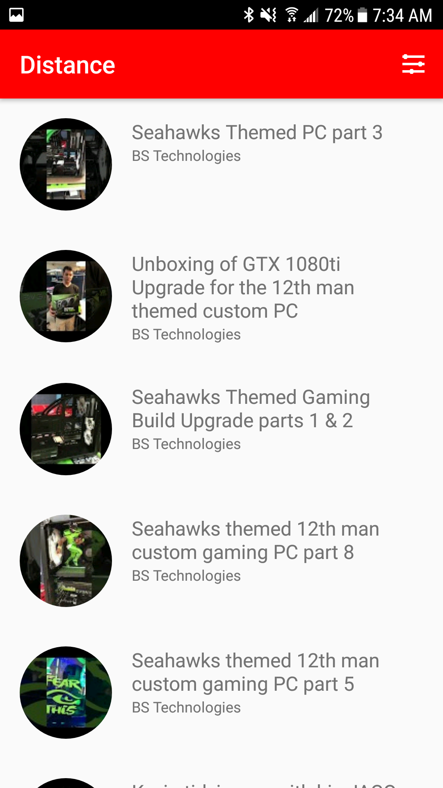
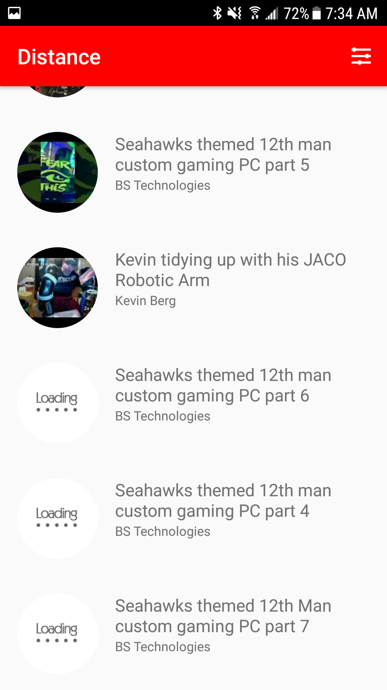

# Distance

## Objective

This app is a neighborhood video search engine. I used the YouTube Data API's search [list(by location)](https://developers.google.com/youtube/v3/docs/search/list) to complete it.

The app retrieves 30 videos relevant to the user's query that were also uploaded within a 5 miles radius of the user's current location, 
anywhere on the planet with internet access.

For debugging & transparency purposes I'm outputing a ``Toast`` of your device's current GPS coordinates upon each search.

**NB:** Testing on a real Android device is preferred.

## The application

