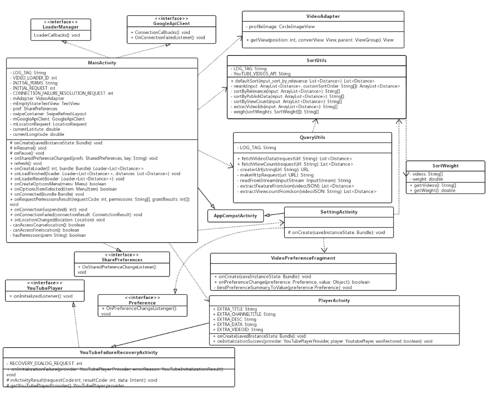

# Distance

## Objective

The problem solved here was the loophole of inefficiency from video search results of YouTube. This problem was important to solve because YouTube was ranked #1 most popular video search engine in 2015 (source: http://tubularinsights.com/video-search-sites/), second by Google. The average YouTube video search results comprise videos relevant to a search query within the entire YouTube platform. That entire platform comprises billions of videos. The search results comprise videos selected by relevance, upload date, view count or rating. However, it is difficult to obtain videos specifically uploaded within a user’s immediate vicinity (in this case, 5 miles) from the YouTube website without searching through many pages of the search results or aggregating relevant queries for a search (e.g: fireworks in Tacoma, WA, etc.). 5 miles was chosen as search radius to mimic a neighborhood-to-neighborhood reliable video search engine.

- API used: YouTube Data API's search [list(by location)](https://developers.google.com/youtube/v3/docs/search/list).

The application retrieves 30 videos relevant to the user's query that were also uploaded within a 5 miles radius of the user's current location, anywhere on the planet with internet access. 

A special re-ranking algorithm was implemented to provide users with an additional layer of accuracy. The re-ranking algorithm used view counts, date published and distance from the user's location to sort videos from search results.

For debugging and transparency purposes I'm outputing a ``Toast`` with your device's current GPS coordinates upon each search.

## Diagram

## Flowchart

## Completed project

